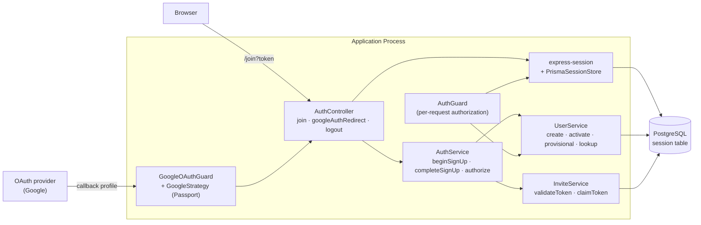
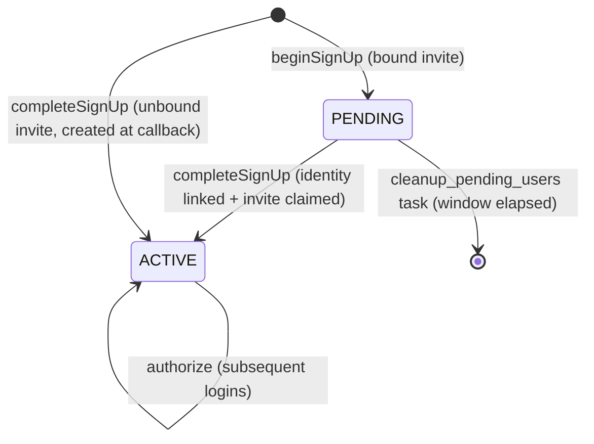
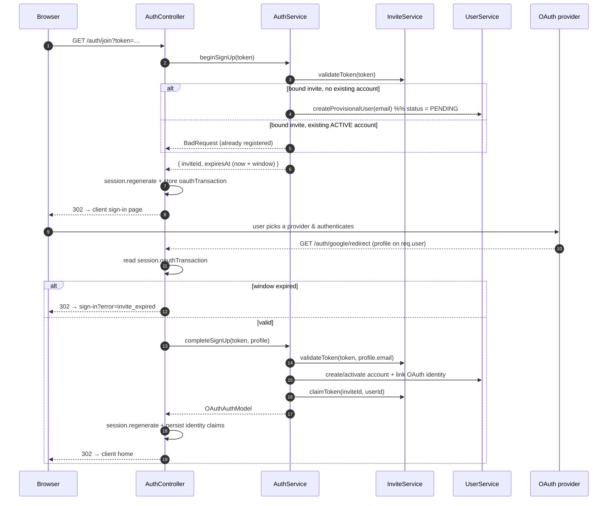
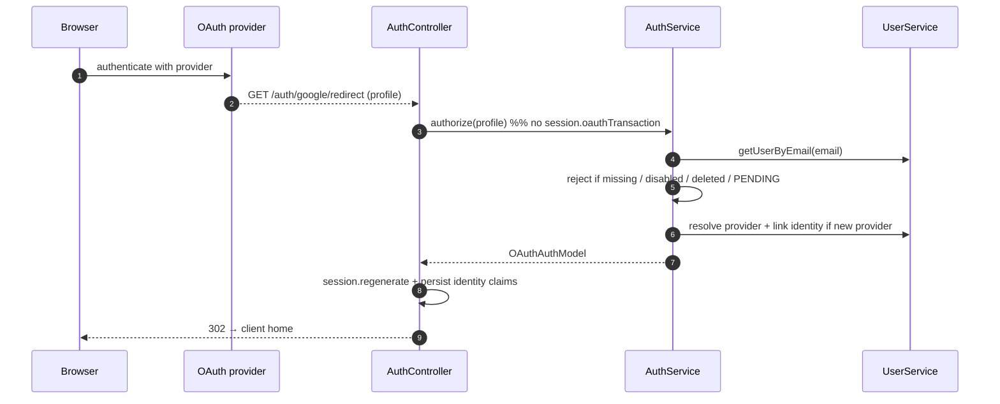
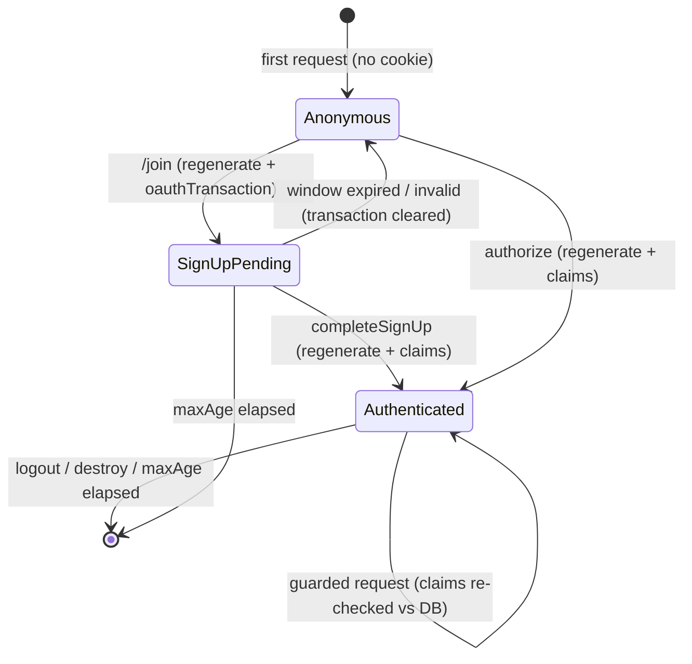
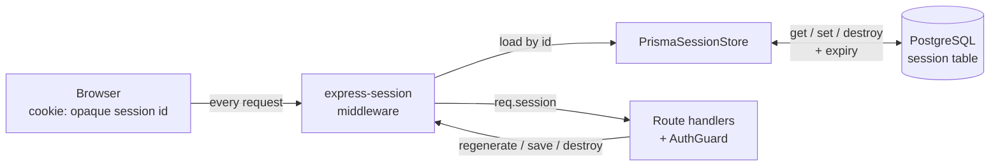
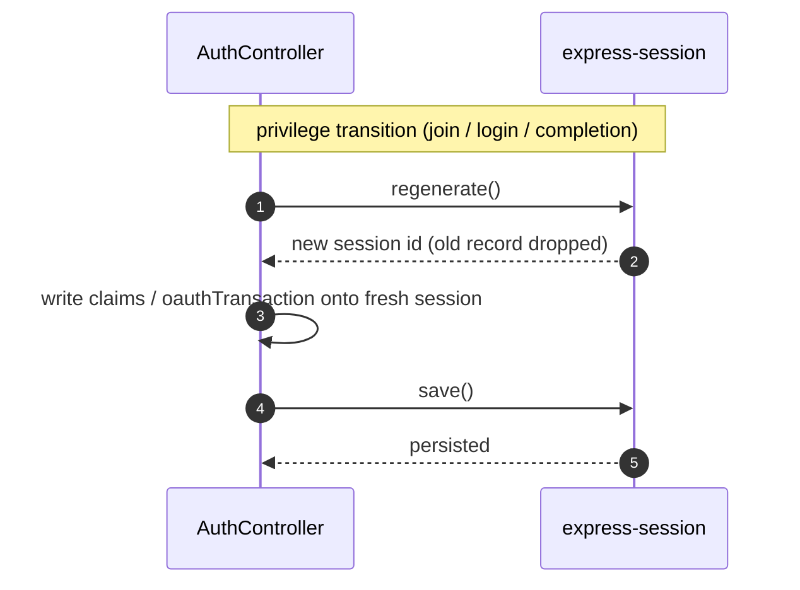
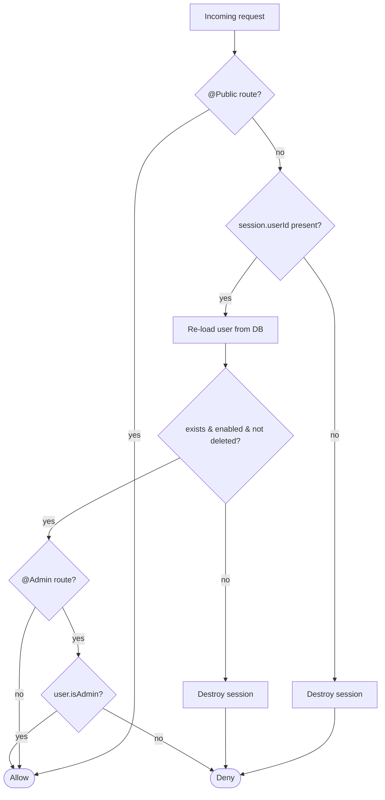

# Authentication & Session Design

HomeGate authenticates users through external OAuth / OpenID identity providers (currently
Google) and maintains logged-in state with server-side, cookie-backed sessions. The application
never stores passwords: the identity provider proves who the user is, and HomeGate maps that
proven identity to a local account.

This document describes how sign-in, invite sign-up, and session lifecycle fit together. For how
invite tokens are minted, hashed, and revoked, see [invites.md](invites.md). For the background
task that reaps abandoned sign-ups, see [scheduler.md](scheduler.md).

## Goals & principles

- **Provider-agnostic.** The flow is driven by the generic `OAuthUserProfileDto`; Google is one
  strategy behind Passport, not a hard-wired assumption. New providers are added as strategies +
  an `OAuthProvider` row without touching the controller/service flow.
- **No provider chosen server-side for sign-up.** `/join` redirects to the client sign-in page so
  the user can pick any enabled provider, rather than being forced onto Google.
- **The invite is the security gate.** Account creation is only ever reachable through a valid,
  unexpired, unrevoked invite token. The token is re-validated on the OAuth callback, not just at
  the start.
- **Sessions are server-authoritative.** The cookie holds only an opaque session id; all identity
  claims live in the server-side session store and are re-checked against the database on every
  guarded request.
- **Session fixation resistance.** The session id is regenerated at every privilege transition
  (start of sign-up, successful login, logout).

## Components

| Component | Responsibility |
| --- | --- |
| `AuthController` | HTTP endpoints; owns the session/cookie side effects (regenerate, save, destroy, redirects). Delegates all business logic to `AuthService`. |
| `GoogleStrategy` / `GoogleOAuthGuard` | Passport strategy that performs the OAuth handshake and normalizes the provider profile into an `OAuthUserProfileDto` on `req.user`. |
| `AuthService` | Provider-agnostic sign-in and invite sign-up logic. Resolves providers, links identities, activates accounts. Never touches the session or HTTP layer. |
| `InviteService` | Validates and consumes invite tokens (hash lookup, expiry, revocation). See [invites.md](invites.md). |
| `UserService` | Account CRUD, provisional-account lifecycle, and OAuth-identity linking. |
| `AuthGuard` | Global `CanActivate` guard authorizing each non-public request from the session. |
| `express-session` + `PrismaSessionStore` | Persists sessions in PostgreSQL; issues/reads the opaque session cookie. |

## Identity model

An account (`User`) is distinct from the identities that can log into it. A single account may
have multiple OAuth identities (one per provider), each keyed by `(providerId, profileId)`. This
is what lets a user who was invited on Google later add, say, a different provider without creating
a second account.

- `User.status` — `PENDING` or `ACTIVE`. `PENDING` accounts are provisional: created during an
  invite sign-up but not yet linked to a real identity. They cannot log in.
- `User.isEnabled` / `User.isDeleted` — administrative gates, independent of `status`.
- `UserOAuthIdentity` — links `(userId, providerId, profileId)`. Created when an identity first
  signs in to an account.

### Account states

## Sign-up (invite redemption)

An invite may be **bound** (issued for a specific email) or **unbound** (bearer). The flow
adapts:

- **Bound invite:** a `PENDING` provisional account is created up-front at `/join`, so the
  identity can be attached to a known account and any duplicate-email conflict surfaces early.
- **Unbound invite:** the email is unknown until the provider callback, so the account is created
  at completion time.

Key points:

- **The invite token travels via the session, not the OAuth callback.** At `/join` the controller
  stores an `oauthTransaction` in the (regenerated) session; the provider callback only carries the
  OAuth profile. This keeps the token off the redirect URL entirely.
- **The invite is claimed only on successful completion** (`completeSignUp` → `claimToken`), never
  at `/join`. That means a provisional account can be safely deleted without reviving a used
  invite — the invite and the account lifecycles never fight each other.
- **`completeSignUp` re-validates the token against the profile email**, so a bound invite cannot
  be redeemed by a different identity than it was issued for.

### Two independent expiries

| Expiry | Owner | Duration | Purpose |
| --- | --- | --- | --- |
| `Invite.expiresAt` | `InviteService.validateToken` | Days | **Security gate.** Re-checked at both `beginSignUp` and `completeSignUp`. |
| `oauthTransaction.expiresAt` | Session, checked in controller | `SIGNUP_COMPLETION_WINDOW_MINUTES` (10 min) | UX / defense-in-depth window to finish sign-in after redirect. Also bounds how long a `PENDING` account may linger. |

`SIGNUP_COMPLETION_WINDOW_MINUTES` lives in [src/types/auth.constants.ts](../src/types/auth.constants.ts).
It is deliberately *not* the security boundary — the invite's own expiry is.

### Reaping abandoned sign-ups

If a user starts a bound-invite sign-up but never completes it, the provisional `PENDING` account
is left behind. The `cleanup_pending_users` scheduled task deletes `PENDING` accounts older than
the completion window (runs every 2 minutes; see [scheduler.md](scheduler.md)). Because the invite
was never claimed, it remains usable until its own `expiresAt`.

## Sign-in (returning user)

For a user who already has an account and identity, there is no invite and no `oauthTransaction`.
The callback goes straight through `authorize`:

`authorize` rejects (returns `null` → `?error=auth_failed`) when the account:

- does not exist for the profile email,
- is `isDeleted` or not `isEnabled`,
- is still `PENDING` (provisional, never completed sign-up),
- presents an identity that conflicts with an existing identity for that provider, or
- names a provider that is unknown or disabled.

When a known, active user signs in through a **new** enabled provider for the first time, `authorize`
links the new `UserOAuthIdentity` to the existing account rather than rejecting — this is the
multi-provider path.

## Session lifecycle

Sessions are managed by `express-session` with a custom `PrismaSessionStore` (PostgreSQL-backed).
The cookie only ever carries an opaque session id; every identity claim is held server-side in the
store. A session moves through three phases over its life:

### Storage & cookie

Configuration lives in [src/main.ts](../src/main.ts):

- `resave: false`, `saveUninitialized: false` — only persist sessions that hold data.
- `cookie.httpOnly: true` — the cookie is not readable from JS.
- `cookie.sameSite: 'lax'` — allows the top-level OAuth redirect while blocking cross-site POSTs.
- `cookie.secure: true` and `trust proxy` — enabled in production only.
- `cookie.maxAge` — 30 days.

### Stored session shape

`SessionData` is augmented in [src/types/express-session.d.ts](../src/types/express-session.d.ts):

| Field | When set | Meaning |
| --- | --- | --- |
| `userId`, `username`, `isAdmin`, `authProviderId` | After a successful login/sign-up | The authenticated identity claims. |
| `csrfToken` | CSRF flow | Per-session CSRF secret. |
| `oauthTransaction` | At `/join`, during sign-up only | `{ inviteToken, inviteId, expiresAt }`; cleared as soon as the callback consumes or expires it. |

### Session id regeneration

`req.session.regenerate` is called at each trust transition to prevent session fixation:

1. **Start of sign-up** (`/join`) — before storing the `oauthTransaction`.
2. **Successful login / sign-up completion** — before persisting the identity claims.
3. **Logout** — `req.session.destroy` removes the record and clears the cookie.

The `oauthTransaction` is always removed once used or expired, so a session never carries stale
sign-up state into an authenticated state.

## Per-request authorization

`AuthGuard` (a global `CanActivate`) authorizes every non-`@Public()` request:

1. `@Public()` handlers/classes bypass the guard.
2. Otherwise a valid `session.userId` is required; missing → destroy session, deny.
3. The user is re-loaded from the database and rejected if missing, `isDeleted`, or not
   `isEnabled` — so administrative changes take effect immediately, not only at next login.
4. `@Admin()` routes additionally require `user.isAdmin`.

Because authorization always re-reads the database, the session cookie alone can never keep a
disabled or deleted user logged in.

## Error handling & redirects

All controller failure paths redirect back to the client sign-in page with an `error` query
parameter, never exposing internals:

| Condition | Redirect |
| --- | --- |
| Missing invite token at `/join` | `?error=missing_token` |
| Invalid / expired / revoked invite at `beginSignUp` | `?error=invalid_invite` |
| Sign-up window elapsed before callback | `?error=invite_expired` |
| Any failure during `authorize` / `completeSignUp` | `?error=auth_failed` |
| Session regenerate/save failure after login | `?error=session_failed` |

## Extending to a new provider

1. Add a Passport strategy that normalizes the provider profile into an `OAuthUserProfileDto`
   (mirror `GoogleStrategy`).
2. Add a guard/route pair analogous to `googleAuth` / `googleAuthRedirect`, both funneling into
   `handleOAuthRedirect`.
3. Register the provider (`OAuthProvider` row, enabled) so `resolveOAuthProvider` accepts it.

No changes to `beginSignUp`, `completeSignUp`, `authorize`, or the session flow are required — they
are already provider-agnostic.
