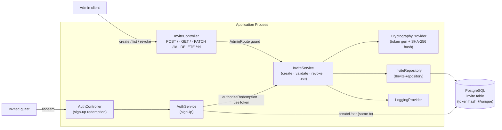
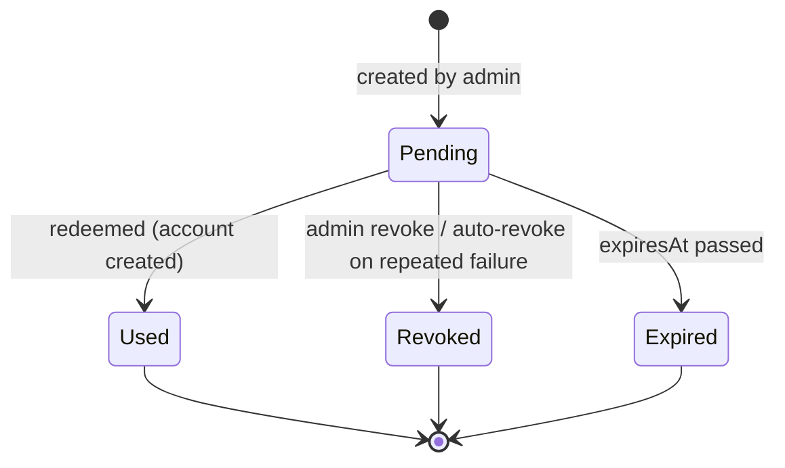
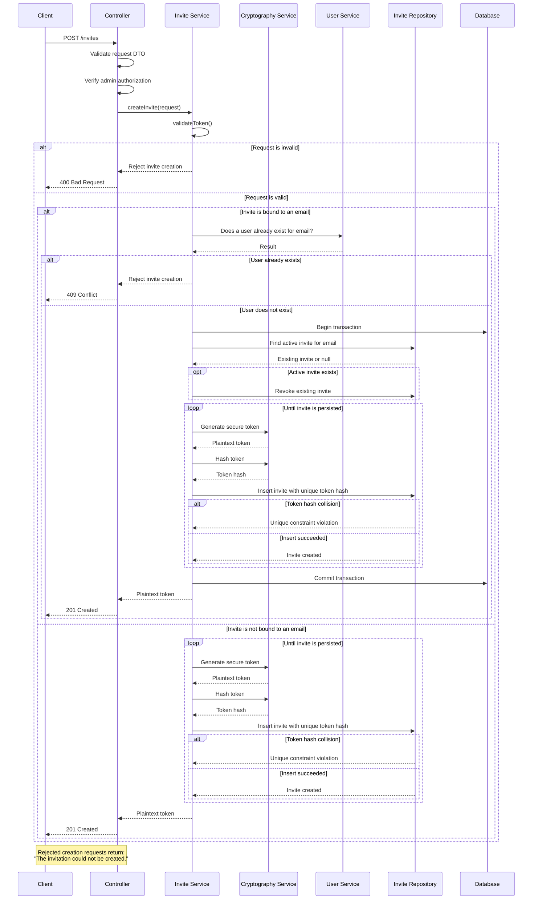
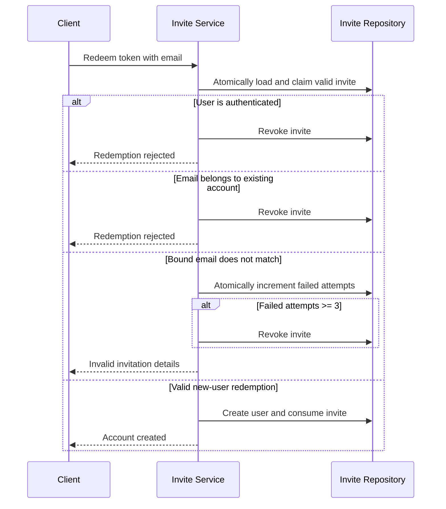
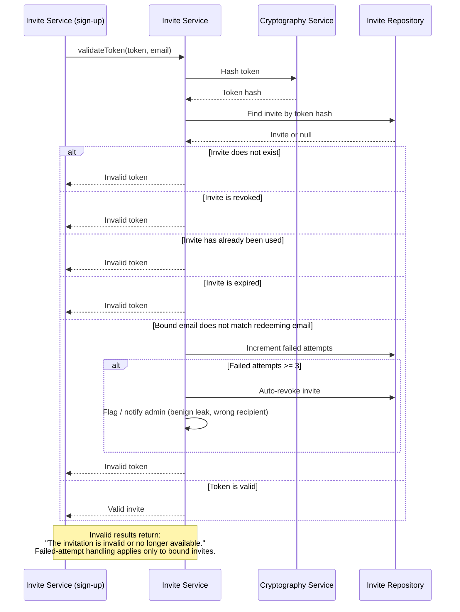

# Invites

Invites allow users to register a new account with HomeGate. Only admins are allowed to generate invite tokens and share invite links to the users they wish to invite to HomeGate. 

Currently invites is the only available option to add users to HomeGate as HomeGate is a private first application.

Invite routes 
`GET /invites/`
`PATCH /invites/:id`
`POST /invites`

# Architecture

Component responsibilities:

- **InviteController** — admin-only surface for the invite lifecycle (create, list,
  revoke). Enforces authorization; delegates all rules to `InviteService`.
- **AuthController / AuthService** — the redemption path. Sign-up calls
  `validateToken(token, email)` then consumes the invite via `useToken` inside the
  **same transaction** that creates the user (see *Redemption Atomicity*).
- **InviteService** — owns all invite rules: token generation, hashing, lifecycle
  transitions, dedup, and redemption validation. The only component that decides
  whether an invite is valid.
- **CryptographyProvider** — generates the high-entropy raw token and computes the
  SHA-256 hash stored at rest. Plaintext is returned to the caller exactly once.
- **InviteRepository** — persistence behind `IInviteRepository`. Stores only the token
  **hash** (`@unique`), never plaintext.
- **PostgreSQL** — single source of truth. Because redemption and user creation share one
  database, invite consumption and account creation run in one transaction.

## Invite Lifecycle

An invite is always in exactly one state. The lifecycle is intentionally simple: an
invite is created in the `Pending` state and moves to exactly one terminal state. There
is no path back to `Pending` — re-inviting a person always mints a **new** invite rather
than reviving an old one.

State notes:

- **Pending** — live and redeemable (not revoked, not used, `expiresAt` in the future).
- **Used** — consumed during a successful redemption. Terminal. A `Used` invite is
  **never** revoked afterwards; the account it produced is the source of truth and
  revoking would only muddy the audit trail.
- **Revoked** — killed by an admin (`PATCH /invites/:id { revoked: true }`) or
  auto-revoked (see *Redemption safety*). Terminal.
- **Expired** — a **derived** state (`expiresAt < now()`), not a stored column. Because
  it is derived, an admin may still `revoke` an expired invite; that transition is treated
  as an idempotent no-op for tidiness.

Only the `Pending -> Revoked` transition is meaningful for the revoke operation. Revoking
an invite that is already `Used` is rejected; revoking one that is already `Revoked` or
`Expired` is a no-op.

### Revocation reason

`AdminRevoked` and `AutoRevoked` are **not** separate states — they behave identically
(terminal, unredeemable, reached from `Pending`). Instead, provenance is recorded as a
discriminator on the terminal `Revoked` state so it is an explicit, stored fact rather
than something inferred (e.g. from the failed-attempt count, which would misclassify and
rot as triggers change):

| Field | Notes |
| --- | --- |
| `revokedAt` | Timestamp the invite entered `Revoked`. Null while `Pending`. |
| `revokedReason` | Why it was revoked. Null while `Pending`; set exactly once on the `Pending -> Revoked` transition. |
| `revokedByUserId` | The admin who revoked it. Set only for `ADMIN`; null for automatic reasons. |

`revokedReason` values:

- `ADMIN` — an admin explicitly revoked via `PATCH /invites/:id { revoked: true }`.
- `AUTO_FAILED_ATTEMPTS` — auto-revoked after repeated wrong-recipient redemption
  attempts on a bound invite (blast-radius containment for a leaked link).
- `AUTO_SUPERSEDED` — auto-revoked because a newer bound invite was issued for the same
  email (see *Uniqueness & Deduplication Policy*).

The enum is intentionally extensible: new automatic triggers add a reason rather than a
new state.

## Email Binding (bound vs. unbound invites)

An invite may optionally be **bound to an email**:

- **Bound invite** (`email` set) — carries an identity claim. Redemption additionally
  requires that the redeeming account's email matches the bound email. This is the
  stronger, preferred variant.
- **Unbound invite** (`email` null) — a **bearer token**: whoever holds a valid link can
  redeem it as any not-yet-existing email. This is a deliberate convenience tradeoff
  (the same model used by comparable self-hosted tools, e.g. Wizarr for Jellyfin) and is
  acceptable given that issuance is admin-only and HomeGate is private-first.

Because an unbound invite has no identity check, its **only** meaningful compensating
control is a **short expiry**. Unbound invites should therefore lean on tight TTLs, and
the failed-attempt protection below does not apply to them (there is no "wrong recipient"
to detect).

## Uniqueness & Deduplication Policy

Deduplication is keyed on **email**:

- **Bound invites** enforce *at most one active (`Pending`) invite per email*. Issuing a
  new bound invite for an email that already has an active one revokes the existing one
  first (with `revokedReason = AUTO_SUPERSEDED`).
- **Unbound invites** are intentionally **not** deduplicated — they have no identity to
  collapse on, so each unbound invite is its own independent bearer credential.

This asymmetry is deliberate, not accidental: dedup requires a natural key, and only
bound invites have one.

Create-flow guard ordering (bound branch): **check user-exists first, then dedup-revoke
any pending invite.** If an account already exists for the email the request is rejected
with `409 Conflict` before any revocation happens, so a consumed invite's history is
never disturbed by a re-issue attempt.

## Creation Limits & Abuse Controls

Invite minting is the boundary at which the "private-first" property can erode, so even
though issuance is admin-only it is bounded:

- **TTL bounds** — `expiresInDays` is validated to a sane range (e.g. `1..30`). This is
  the primary compensating control for unbound invites, so it is enforced deliberately
  rather than left open-ended.
- **Max outstanding invites** — a cap on the number of `Pending` invites (per admin
  and/or global) limits the blast radius of a careless or compromised admin account
  minting many live bearer tokens at once.
- **Issuance rate limit** — `POST /invites` is throttled (per-burst) in addition to the
  outstanding cap (per-total).
- **Unbound is opt-in** — creating an unbound invite requires an explicit choice so the
  convenient path is never the accidental default.

Because every invite records `createdByUserId`, all of the above is auditable per admin.

# Create Invite Flow

# Redeem Invite

# Validate Token

Validation exists as a single internal surface used during redemption. Admins do not
need a separate "is this invite live?" endpoint — they can inspect invite state directly
through the existing admin read surfaces (`GET /invites` list, which exposes each
invite's lifecycle fields).

## Redemption validation — `validateToken(token, email)`

Internal only; called during sign-up. Performs the full validation **including** the
email-binding match, and drives the failed-attempt handling. This is the only surface
where the identity check runs, because it is the only place an account is actually
created.

# Revoke Token

`PATCH /invites/:id { revoked: true }` revokes an invite. It is a **soft delete**: the row
is kept for audit and the invite transitions `Pending -> Revoked` (with
`revokedReason = ADMIN`). There is no separate deleted state or `deletedAt` column —
revoking is the only way an admin removes an invite.

