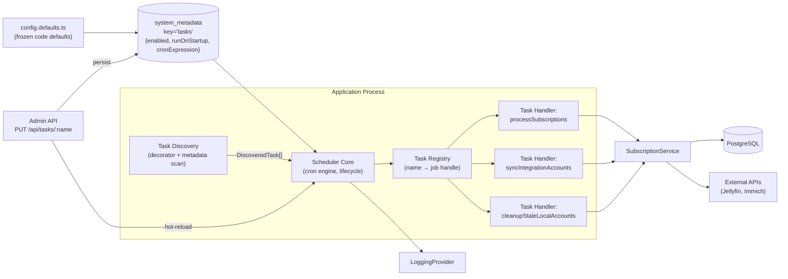
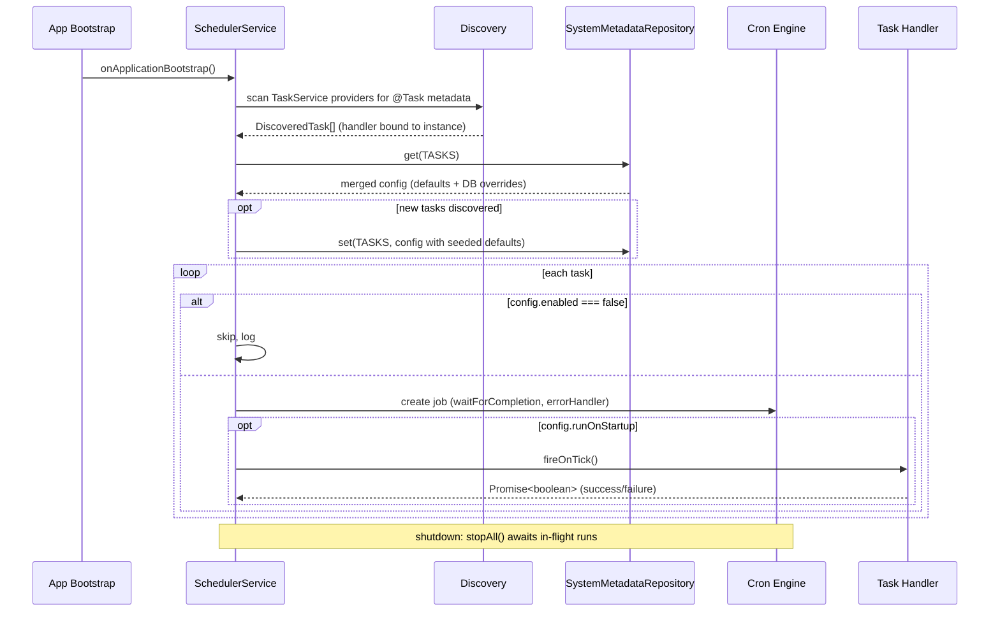
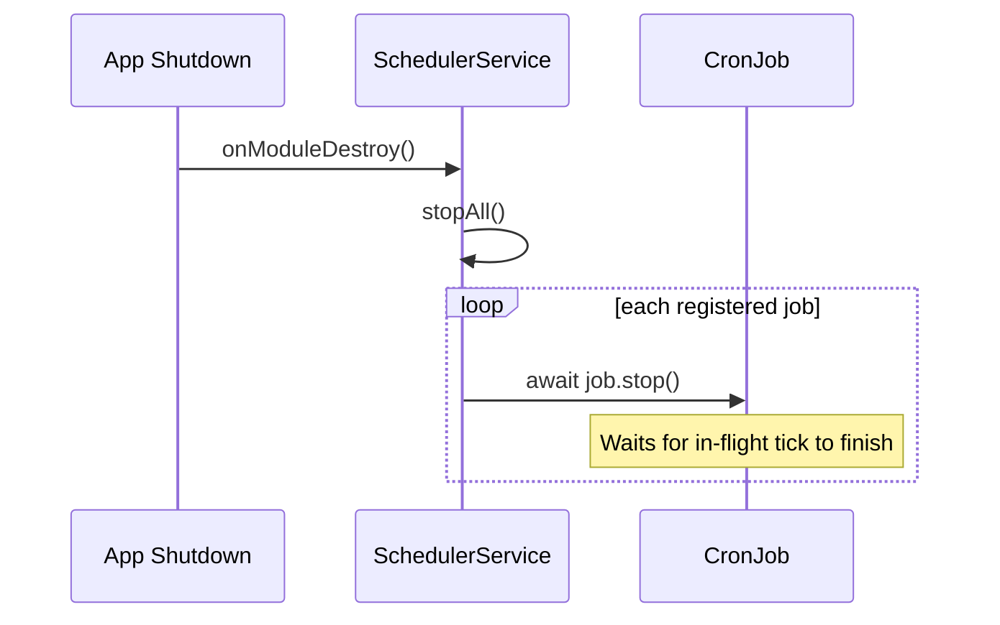
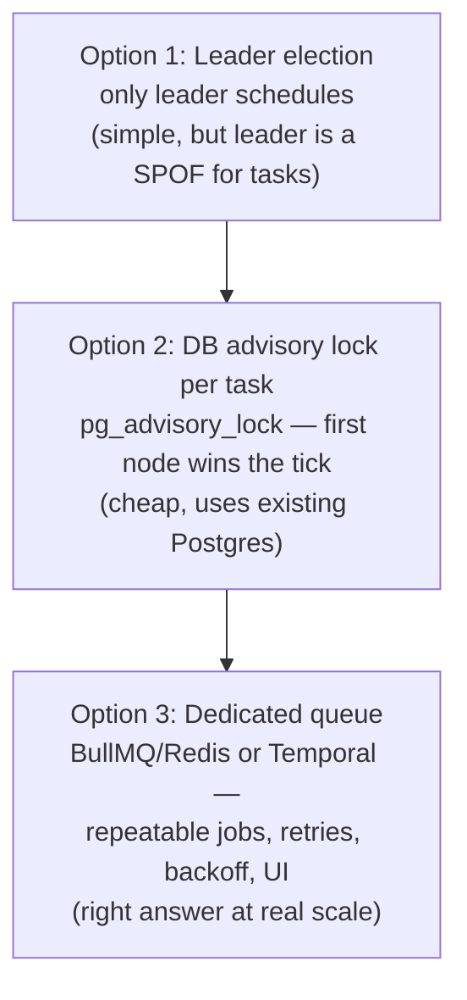

# Scheduled Tasks

The scheduler discovers and runs background tasks on cron schedules. Tasks are defined in `TaskService` using the `@Task` decorator; runtime configuration (enabled, runOnStartup, cronExpression) is stored in the `system_metadata` table and served by `SystemMetadataRepository`.

## Architecture



### Configuration Resolution

```
@Task decorator          systemDefaults            system_metadata (DB)
(discovery only)         (code fallback)           (runtime override)

name: X ──────────►  { enabled: true,      ◄──── { enabled: false,
                       runOnStartup: false,        cronExpression: 6h }
                       cronExpression: 12h }

                              │ merge: DB wins over defaults │
                              ▼
                    Effective: enabled=false, runOnStartup=false, cron=6h
```

- No DB row → defaults returned as-is (fresh install works with zero seeding)
- DB field null/missing → default kept
- DB field has value → overrides

### Scheduler Lifecycle



### Shutdown



### Key Properties

- **Discovery** is restricted to `TaskService` instances (`instanceof` check). Decorated methods on other providers are ignored.
- **Handlers** must be zero-argument and return `Promise<boolean>` (true = success, false = failure).
- **No-overlap**: `waitForCompletion: true` ensures a tick finishes before the next fires.
- **Failure isolation**: each tick is wrapped with an `errorHandler` — one failing task never crashes the process or blocks siblings.
- **Graceful shutdown**: `stopAll()` awaits in-flight executions before the process exits.
- **Auto-seed**: first boot or newly-added tasks are automatically seeded with code defaults to the DB.
- **Hot-reload**: admin API changes take effect immediately without restart.

## Adding a New Task

1. Add an enum value to `ScheduledTasks` in `src/types/enums.ts`.
2. Add defaults to `src/data/config.defaults.ts`:

```typescript
[ScheduledTasks.MY_NEW_TASK]: {
    enabled: true,
    runOnStartup: false,
    cronExpression: CronExpression.EVERY_DAY_AT_MIDNIGHT,
},
```

3. Add a method to `TaskService`, routing the work through `runTask()`:

```typescript
@Task(ScheduledTasks.MY_NEW_TASK)
async myNewTaskHandler(): Promise<boolean> {
    return this.runTask(ScheduledTasks.MY_NEW_TASK, () => this.someService.doWork())
}
```

4. That's it — the scheduler discovers it automatically at bootstrap, seeds the DB with defaults, and `runTask()` handles start/success/failure logging and timing.

## Task Configuration

The `@Task(ScheduledTasks.X)` decorator marks a method for discovery — it carries only the task name. All runtime behavior is controlled via `system_metadata` (key = `tasks`) and code defaults in `config.defaults.ts`:

| Field | Type | Default | Description |
|-------|------|---------|-------------|
| `enabled` | `boolean` | `true` | Set `false` to skip scheduling entirely |
| `runOnStartup` | `boolean` | varies | Fire the handler immediately on app boot |
| `cronExpression` | `string` | from `config.defaults.ts` | Effective cron schedule |

## Admin API

| Method | Path | Auth | Description |
|--------|------|------|-------------|
| `GET` | `/api/tasks` | Admin | List all task configs + running status |
| `PUT` | `/api/tasks/:name` | Admin | Partial update → persist + hot-reload |

### GET /api/tasks

Returns an array of task configs with their current active state:

```json
[
  {
    "name": "process_subscriptions",
    "enabled": true,
    "runOnStartup": true,
    "cronExpression": "0 0 * * * *",
    "isActive": true
  }
]
```

### PUT /api/tasks/:name

Accepts a partial update body. Validates the cron expression and applies changes immediately:

```json
{
  "enabled": false,
  "cronExpression": "0 */6 * * *"
}
```

## Current Tasks

| Task | Default Schedule | Default Startup | Description |
|------|-----------------|-----------------|-------------|
| `process_subscriptions` | Every hour | Yes | Processes expired/active subscriptions and updates user access |
| `sync_integration_accounts` | Every 12 hours | **No** | Syncs external service accounts (Jellyfin/Immich) with local records |
| `cleanup_stale_local_accounts` | Every 12 hours | Yes | Removes local account records that no longer have an external counterpart |

## Operational Notes

- **Logs**: Every task is wrapped by `TaskService.runTask()`, which logs consistently regardless of which handler runs:
  - `debug`: `Task '<name>' started`
  - `debug`: `Task '<name>' finished in <ms>ms with success=<true|false>`
  - `error` (on throw): `Task '<name>' failed after <ms>ms` with the stack trace attached
- **Dangerous tasks**: `sync_integration_accounts` defaults to `runOnStartup: false` because it disables external users flagged as orphans (no local record). If the local DB is empty or incomplete, this will mass-disable legitimate users.
- **Recovery script**: `scripts/enable-jellyfin-users.ts` re-enables disabled Jellyfin users. Run with `--apply` to execute (dry-run by default).

## Failure Modes

| Failure | Mitigation |
|---|---|
| Handler throws | Per-tick `errorHandler` logs and records; schedule survives |
| Overlapping runs | `waitForCompletion` serializes ticks on a single node |
| Process crash mid-run | Tasks must be **idempotent** — re-running must converge, not compound |
| Destructive false positives | Tasks acting on the *absence* of data (e.g. orphan detection) need dry-run defaults and blast-radius guards |

## Scaling Evolution

In-process cron is correct and free on a single node. If the server is ever scaled horizontally, N replicas would fire N times per tick. Migration path, in order of increasing complexity:



Option 2 (Postgres advisory locks keyed on task name) is the recommended first step — no new infrastructure, and the zero-arg `TaskHandler` contract doesn't change.

## Design Decisions

| Decision | Rationale |
|----------|-----------|
| `system_metadata` key-value table | One table forever — no migrations for new config categories |
| `EnvRepository` separate from `SystemMetadataRepository` | Env = infrastructure (pre-DB); system_metadata = application behavior (post-DB) |
| Custom scheduler over `@nestjs/schedule` `@Cron()` | `@Cron` options are compile-time constants; we need runtime/config-driven behavior |
| Discovery restricted to `TaskService` | Prevents accidental scheduling from unrelated services; single place to audit |
| `Promise<boolean>` return type | Forces explicit success/failure signal for future run-history tracking |
| Zero-arg handlers | Keeps reflection-based discovery safe; dependencies come from the injected service |
| `waitForCompletion` | Prevents overlapping runs on a single node without distributed locking |
| Decorator carries only the task name | All config lives in one place (DB + code defaults); no stale compile-time values |
| `sync_integration_accounts` defaults to `runOnStartup: false` | Prevents the orphan-disable incident on fresh/incomplete environments |
| Auto-seed on discovery | Admin UI always shows all tasks without manual DB inserts |
| Hot-reload via direct method call | Simple; add event bus later when multiple services need to react |
