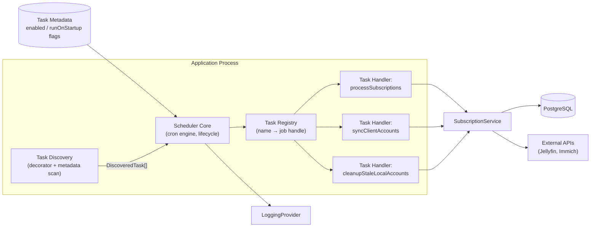
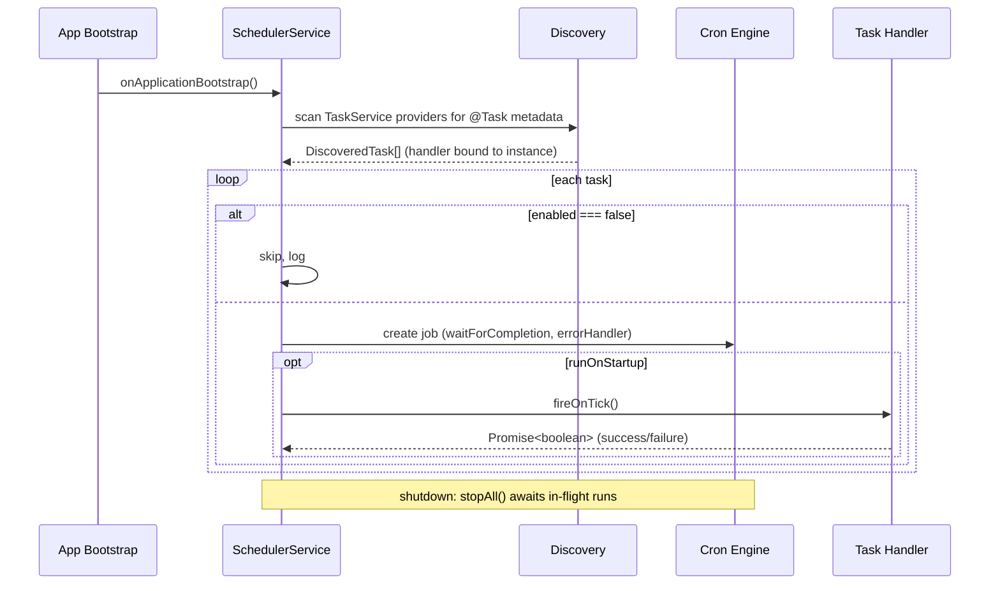
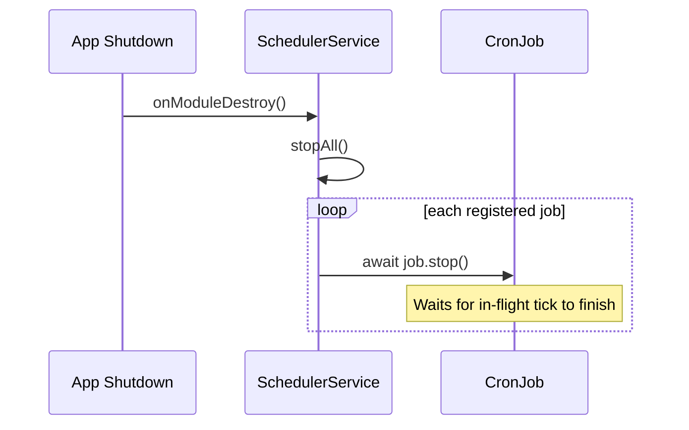
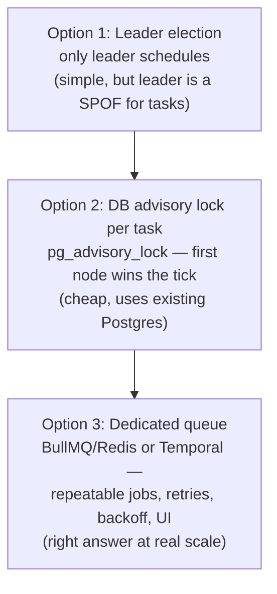

# Scheduled Tasks

The scheduler discovers and runs background tasks on cron schedules. Tasks are defined in `TaskService` using the `@Task` decorator and executed by `SchedulerService` at application bootstrap.

## Architecture



### Scheduler Lifecycle



### Shutdown



### Key Properties

- **Discovery** is restricted to `TaskService` instances (`instanceof` check). Decorated methods on other providers are ignored.
- **Handlers** must be zero-argument and return `Promise<boolean>` (true = success, false = failure).
- **No-overlap**: `waitForCompletion: true` ensures a tick finishes before the next fires.
- **Failure isolation**: each tick is wrapped with an `errorHandler` — one failing task never crashes the process or blocks siblings.
- **Graceful shutdown**: `stopAll()` awaits in-flight executions before the process exits.

## Adding a New Task

1. Add an enum value to `ScheduledTasks` in `src/types/enums.ts`.
2. Add a method to `TaskService`, routing the work through `runTask()` for consistent logging:

```typescript
@Task({
    name: ScheduledTasks.MY_NEW_TASK,
    cronExpression: CronExpression.EVERY_DAY_AT_MIDNIGHT,
    runOnStartup: false,
})
async myNewTaskHandler(): Promise<boolean> {
    return this.runTask(ScheduledTasks.MY_NEW_TASK, () => this.someService.doWork())
}
```

3. That's it — the scheduler discovers it automatically at bootstrap, and `runTask()` handles start/success/failure logging and timing.

## Task Configuration

| Option | Type | Default | Description |
|--------|------|---------|-------------|
| `name` | `ScheduledTasks` | required | Unique identifier for the task |
| `cronExpression` | `CronExpression \| string` | required | Standard cron expression or `@nestjs/schedule` preset |
| `enabled` | `boolean` | `true` | Set `false` to skip scheduling entirely |
| `runOnStartup` | `boolean` | `false` | Fire the handler immediately on app boot |

## Current Tasks

| Task | Schedule | Startup | Description |
|------|----------|---------|-------------|
| `process_subscriptions` | Every hour | Yes | Processes expired/active subscriptions and updates user access |
| `sync_client_accounts` | Every 12 hours | Yes | Syncs external service accounts (Jellyfin/Immich) with local records |
| `cleanup_stale_local_accounts` | Every 12 hours | Yes | Removes local account records that no longer have an external counterpart |

## Runtime Control

`SchedulerService` exposes `start(metadata)` and `stop(metadata)` for runtime enable/disable (e.g. from an admin endpoint):

```typescript
schedulerService.stop({ name: ScheduledTasks.SYNC_CLIENT_ACCOUNTS, cronExpression: '...' })
schedulerService.start({ name: ScheduledTasks.SYNC_CLIENT_ACCOUNTS, cronExpression: '...' })
```

## Operational Notes

- **Logs**: Every task is wrapped by `TaskService.runTask()`, which logs consistently regardless of which handler runs:
  - `debug`: `Task '<name>' started`
  - `debug`: `Task '<name>' finished in <ms>ms with success=<true|false>`
  - `error` (on throw): `Task '<name>' failed after <ms>ms` with the stack trace attached
- **Dangerous tasks**: `sync_client_accounts` disables external users flagged as orphans (no local record). If the local DB is empty or incomplete, this will mass-disable legitimate users. Disable `runOnStartup` or the task itself in new environments until local records are seeded.
- **Recovery script**: `scripts/enable-jellyfin-users.ts` re-enables disabled Jellyfin users. Run with `--apply` to execute (dry-run by default).

## Failure Modes

| Failure | Mitigation |
|---|---|
| Handler throws | Per-tick `errorHandler` logs and records; schedule survives |
| Overlapping runs | `waitForCompletion` serializes ticks on a single node |
| Process crash mid-run | Tasks must be **idempotent** — re-running must converge, not compound |
| Destructive false positives | Tasks acting on the *absence* of data (e.g. orphan detection) need dry-run defaults and blast-radius guards |

## Scaling Evolution

In-process cron is correct and free on a single node. If the server is ever scaled horizontally, N replicas would fire N times per tick. Migration path, in order of increasing complexity:



Option 2 (Postgres advisory locks keyed on task name) is the recommended first step — no new infrastructure, and the zero-arg `TaskHandler` contract doesn't change.

## Design Decisions

| Decision | Rationale |
|----------|-----------|
| Custom scheduler over `@nestjs/schedule` `@Cron()` | `@Cron` options are compile-time constants; we need runtime/config-driven `enabled` |
| Discovery restricted to `TaskService` | Prevents accidental scheduling from unrelated services; single place to audit |
| `Promise<boolean>` return type | Forces explicit success/failure signal for future run-history tracking |
| Zero-arg handlers | Keeps reflection-based discovery safe; dependencies come from the injected service |
| `waitForCompletion` | Prevents overlapping runs on a single node without distributed locking |
